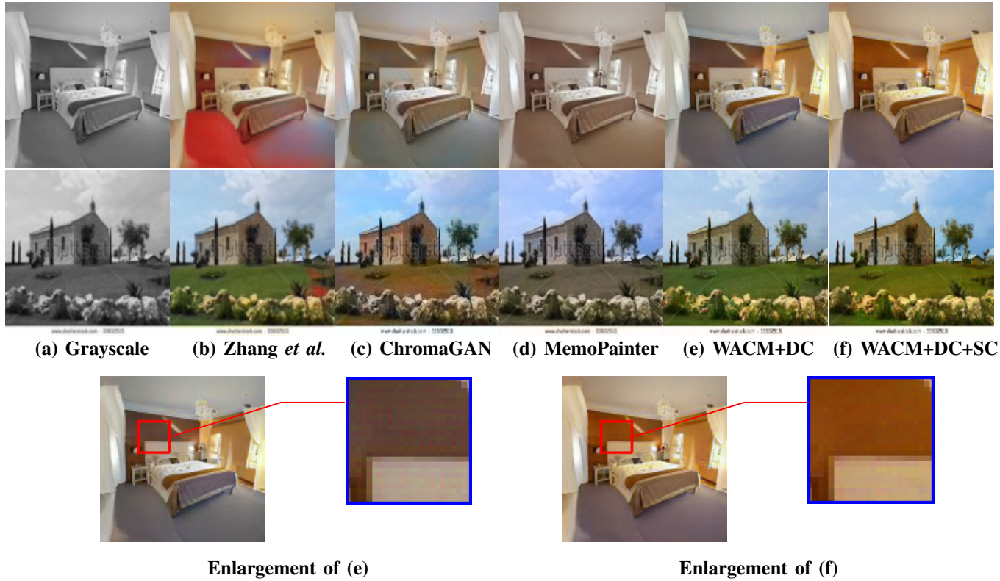
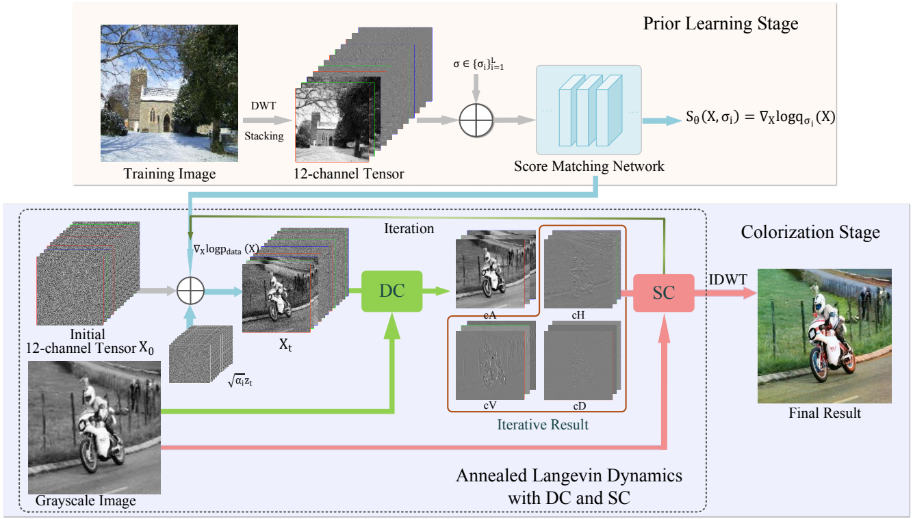

# WACM

Wavelet Transform-assisted Adaptive Generative Modeling for Colorization

**Authors**: Jin Li, Wanyun Li, Zichen Xu, Yuhao Wang* and Qiegen Liu*   

IEEE Transactions on Multimedia, https://ieeexplore.ieee.org/abstract/document/9782538   

Date : 7/2021 
The code and the algorithm are for non-commercial use only. 
Copyright 2021, Department of Electronic Information Engineering, Nanchang University.  

​    Unsupervised deep learning has recently demonstrated the promise to produce high-quality samples. While it has tremendous potential to promote the image colorization task, the performance is limited owing to the manifold hypothesis in machine learning. This study presents a novel scheme that exploiting the score-based generative model in wavelet domain to address the issue. By taking advantage of the multi-scale and multi-channel representation via wavelet transform, the proposed model learns the priors from stacked wavelet coefficient components, thus learns the image characteristics under coarse and detail frequency spectrums jointly and effectively. Moreover, such a highly flexible generative model without adversarial optimization can execute colorization tasks better under dual consistency terms in wavelet domain, namely data-consistency and structure-consistency. Specifically, in the training phase, a set of multi-channel tensors consisting of wavelet coefficients are used as the input to train the network by denoising score matching. In the test phase, samples are iteratively generated via annealed Langevin dynamics with data and structure consistencies. Experiments demonstrated remarkable improvements of the proposed model on colorization quality, particularly on colorization robustness and diversity.

## Visulization of the performance of WACM
  
Visual comparison of Zhang et al. (b), ChromaGAN (c), MemoPainter (d) and WACM with different constraints (e, f).   
## The Flowchart of WACM
  
Iterative colorization procedure of WACM. 


## Dependencies


natsort 7.0.1

Pillow 8.2.0

PyJWT 1.7.1

PyYAML 5.3.1

scikit-image 0.16.2

seaborn 0.11.1

tensorboard 2.4.0

tensorboardX 2.1

torch 1.7.1

tqdm 4.59.0

## Test
if you want to test the WACM model for colorization, please 

```bash 
python3.5 WACM_main.py --WACM Test_colorizaiton --doc church_128(your checkpoint folder) --test --image_folder results(your output folder)
```

if you want to test the WACM model for generation on CelebA dataset, please

```bash 
python3.5 WACM_main.py --WACM Test_CelebAGeneration_WACM --doc WACM_celeba_128(your checkpoint folder) --test --image_folder results(your output folder)
```

if you want to test the NCSN model for generation on CelebA dataset, please

```bash 
python3.5 WACM_main.py --WACM Test_CelebAGeneration_NCSN --doc NCSN_celeba_128(your checkpoint folder) --test --image_folder results(your output folder)
```

## Checkpoints

We provide pretrained checkpoints in [Google drive](https://drive.google.com/drive/folders/15sMyRCCY_zPvQqHMt91cGzODy-I4Pbey?usp=sharing). You can download the folders containing checkpoint.pth and config.yml, then place them in the corresponding path to test the model.

We choose three datasets for experiments, including LSUN-bedroom, LSUN-church and COCO-stuff.


### Other Related Projects

  * Homotopic Gradients of Generative Density Priors for MR Image Reconstruction  
[<font size=5>**[Paper]**</font>](https://ieeexplore.ieee.org/abstract/document/9435335)   [<font size=5>**[Code]**</font>](https://github.com/yqx7150/HGGDP)   [<font size=5>**[PPT]**</font>](https://github.com/yqx7150/HGGDP/tree/master/Slide)   [<font size=5>**[数学图像联盟会议交流PPT]**</font>](https://github.com/yqx7150/EDAEPRec/tree/master/Slide)

 * Iterative Reconstruction for Low-Dose CT using Deep Gradient Priors of Generative Model  
[<font size=5>**[Paper]**</font>](https://ieeexplore.ieee.org/abstract/document/9703672)   [<font size=5>**[Code]**</font>](https://github.com/yqx7150/EASEL)   [<font size=5>**[PPT]**</font>](https://github.com/yqx7150/HGGDP/tree/master/Slide)

  * Universal Generative Modeling for Calibration-free Parallel MR Imaging  
[<font size=5>**[Paper]**</font>](https://biomedicalimaging.org/2022/)   [<font size=5>**[Code]**</font>](https://github.com/yqx7150/UGM-PI)   [<font size=5>**[Poster]**</font>](https://github.com/yqx7150/UGM-PI/blob/main/paper%20%23160-Poster.pdf)    
     
 * Progressive Colorization via Interative Generative Models  
[<font size=5>**[Paper]**</font>](https://ieeexplore.ieee.org/document/9258392)   [<font size=5>**[Code]**</font>](https://github.com/yqx7150/iGM)   [<font size=5>**[PPT]**</font>](https://github.com/yqx7150/HGGDP/tree/master/Slide)   [<font size=5>**[数学图像联盟会议交流PPT]**</font>](https://github.com/yqx7150/EDAEPRec/tree/master/Slide)

 * Diffusion Models for Medical Imaging
[<font size=5>**[Paper]**</font>](https://github.com/yqx7150/Diffusion-Models-for-Medical-Imaging)   [<font size=5>**[Code]**</font>](https://github.com/yqx7150/Diffusion-Models-for-Medical-Imaging)   [<font size=5>**[PPT]**</font>](https://github.com/yqx7150/HKGM/tree/main/PPT) 
